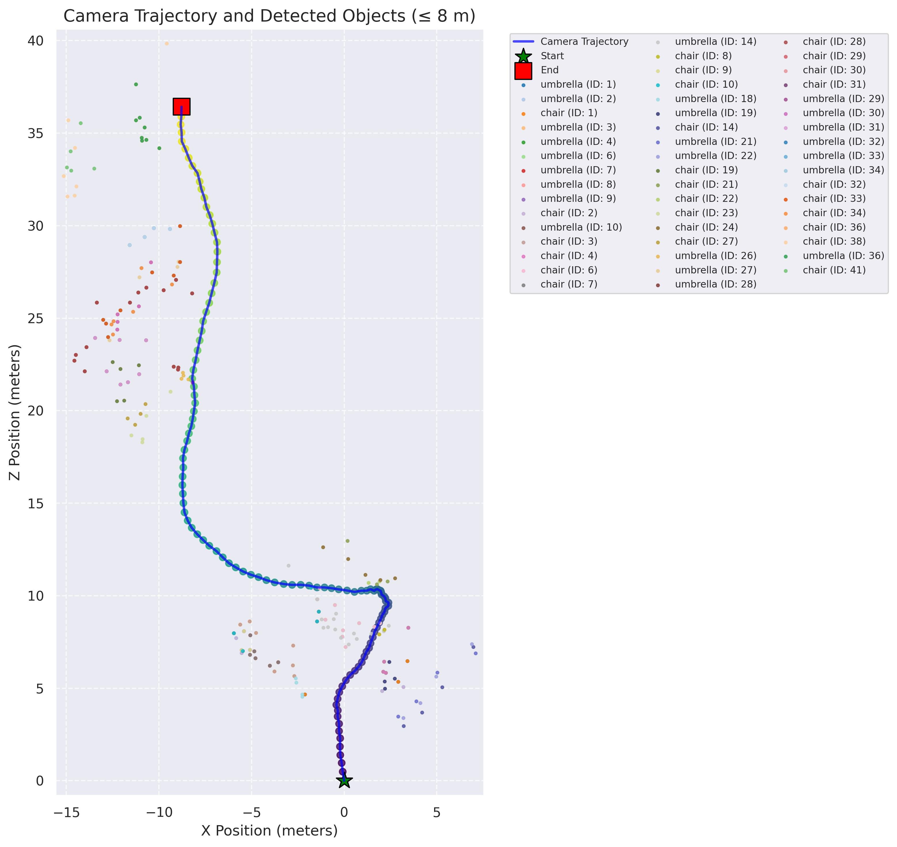

# DatasetGenPipeline
输入一段第一人称视角拍摄的短视频（2min左右），轨迹和所见的物体映射到2D地图上，生成一张 local map



## 项目简介

本项目实现了一个基于第一人称拍摄视频的 **局部地图 (local map) 构建管道**。
通过整合 **COLMAP、DPVO、Grounded-SAM-2、Metric3D** 等工具，可以自动完成：

1. **相机内参估计**（使用 COLMAP）。
2. **相机轨迹估计**（使用 DPVO）。
3. **物体检测与分割**（使用 Grounded-SAM-2 + Grounding DINO）。
4. **深度估计与点云重建**（使用 Metric3D）。
5. **轨迹与点云的尺度对齐**（通过 DPVO 点云与 Metric3D 点云的匹配）。
6. **物体坐标从相机系转换到世界系**。
7. **生成 Local Map**（包含相机轨迹与检测到的物体位置）。

## 使用方法

### 运行主入口

调用 `CombinedPipeline.process_video` 来处理视频：

```python
from pipeline import CombinedPipeline

pipeline = CombinedPipeline()

# 设置模型路径
pipeline.set_model_paths(
    sam2_checkpoint="path/to/sam2_ckpt.pth",
    model_cfg="path/to/sam2_cfg.yaml",
    grounding_dino_config="path/to/grounding_dino_cfg.py",
    grounding_dino_checkpoint="path/to/grounding_dino_ckpt.pth",
    metric3d_config="path/to/metric3d_cfg.py",
    metric3d_ckpt="path/to/metric3d_ckpt.pth"
)

# 运行视频处理
output_video = pipeline.process_video(
    video_path="your_video.mp4",
    text_prompt="chair, table, person",  # 需要检测的类别
    output_dir="./outputs",
    max_seconds=30,
    frames_per_second=2.0,
    colmap_interval=2.0,
    need_run_dpvo=True,
    max_distance=7.0
)
```

运行后将生成：

* **处理后的视频**（带检测框和分割结果）
* **可视化的 local map**
* **图像mask、深度图、轨迹文件等等中间生成物**


## 代码流程

### 1. 相机内参计算（`_compute_average_focal_lengths`）

* 从视频中按间隔抽帧。
* 使用 COLMAP 进行特征提取、匹配和增量重建。
* 得到焦距参数 `fx, fy` 和图像中心点 `cx, cy`。
* 写入 `intrinsic.txt` 与 DPVO 的 `camera.txt`。

### 2. 相机轨迹估计（`run_dpvo`）

* 使用 DPVO 从视频帧中恢复相机位姿。
* 输出轨迹文件（TUM 格式）、轨迹图、点云文件。
* 点云保存为 `.ply`。

### 3. 模型初始化（`initialize_models`）

* 初始化 **SAM2 视频预测器**、**Grounding DINO**、**Metric3D**。
* 不同模型根据显存情况选择混合精度或 FP32。

### 4. 物体检测与跟踪（`_process_frame_batch`）

* 使用 Grounding DINO 根据文本提示检测目标。
* 使用 SAM2 对目标做精细分割并跨帧传播。
* 保存 mask（`.npy`）、JSON 元数据、可视化结果。

### 5. 深度估计（`_initialize_metric3d` + `do_scalecano_test_with_custom_data_my_designed`）

* 使用 Metric3D 估计深度图。
* 输出 `.npy` 深度文件、`.ply` 点云文件。

### 6. 尺度对齐（`align_scale_with_metric3d`）

* 将 DPVO 点云投影到相机平面。
* 与 Metric3D 深度点云进行匹配。
* 使用 RANSAC 拟合 **全局尺度因子**。
* 修正轨迹与点云的绝对尺度。

### 7. 生成 Local Map（`_generate_local_map` / `generate_visualization`）

* 绘制相机轨迹（蓝线 + 渐变点）。
* 标记起点和终点。
* 将检测到的物体在世界坐标系中绘制到地图。
* 输出 `local_map.jpg`。

## 主要函数说明

### 类：`CombinedPipeline`

项目的核心类，负责组织整个流程。

#### 设置与初始化

* `set_model_paths(...)`：设置模型路径。
* `initialize_models(...)`：加载所有模型。
* `_initialize_metric3d(...)`：加载 Metric3D。

#### 相机与轨迹

* `_compute_average_focal_lengths(video_path, colmap_interval)`：COLMAP 估计焦距。
* `_get_first_frame_dimensions(frames_dir)`：读取图像尺寸和中心点。
* `_create_dpvo_calibration_file(video_output_dir)`：生成 DPVO 所需的 `camera.txt`。
* `run_dpvo(...)`：运行 DPVO 获取轨迹与点云。

#### 尺度与位姿

* `align_scale_with_metric3d(...)`：使用 Metric3D 点云对齐 DPVO 轨迹。
* `_apply_scale_to_poses(scale)`：应用尺度到位姿。
* `_apply_scale_to_point_cloud(scale)`：应用尺度到点云。
* `_save_scaled_trajectory(file, scale)`：保存尺度修正后的轨迹。

#### 物体检测与跟踪

* `_process_frame_batch(...)`：单批帧的物体检测与 mask 传播。
* `_propagate_and_save_masks(...)`：mask 传播。
* `_save_mask_and_json(...)`：保存 mask 和 JSON。
* `_draw_masks_with_position(...)`：计算物体在世界坐标中的位置。

#### 可视化与结果

* `_generate_local_map(output_dir, object_positions)`：生成局部地图。
* `generate_visualization(...)`：轨迹 + 物体可视化。
* `process_video(...)`：主入口，整合所有步骤。

## 输出结果目录结构

处理完成后，`output_dir` 下会包含以下结构：

```
outputs/
  result_dir/
    output_video/        # 处理后的视频
    local_map/           # local map 可视化图
  yourvideo_xxx/
    frames/              # 抽取的帧
    dpvo/                # DPVO结果（轨迹、点云、colmap文件）
    colmap/              # 相机内参文件
    mask_data/           # SAM2生成的mask
    json_data/           # 物体信息json
    depth_data/          # Metric3D深度点云
    result/              # 带可视化结果的帧
    mask_photo/          # mask渲染图
    depth_photo/         # 深度渲染图
```


## 环境部署
#### PS：
> 相关开源项目的 git clone 已经放入这个项目了，必要的权重数据也已放在对于位置。所以只需要按下面步骤配置好 conda 环境中的依赖就可以了，不用克隆其他仓库和下载其他权重资源。
### 克隆 DatasetGenPipeline
```
git clone https://github.com/HowLegend/DatasetGenPipeline.git
cd DatasetGenPipeline

```
### 创建 conda 环境
使用 python=3.10 以及 torch >= 2.3.1、torchvision>=0.18.1 和 cuda-12.1 以上

根据自己环境来安装特定的 conda 环境

```
conda create -n dgp python=3.10 -y
conda activate dgp
pip install torch==2.5.1 torchvision==0.20.1 torchaudio==2.5.1 --index-url https://download.pytorch.org/whl/cu124
```

### 部署 Grounded-SAM-2
```
git clone https://github.com/IDEA-Research/Grounded-SAM-2.git
```
下载 Segment Anything 2 权重
```
cd Grounded-SAM-2
cd checkpoints
bash download_ckpts.sh
cd ..
```
下载 Grounding DINO 权重
```
cd gdino_checkpoints
bash download_ckpts.sh
cd ..
```
安装 Segment Anything 2
```
pip install -e .
```
安装 Grounding DINO
```
pip install --no-build-isolation -e grounding_dino
```
返回主目录 DatasetGenPipeline
```
cd ..
```
### 部署 Metric3D
```
git clone https://github.com/YvanYin/Metric3D.git
cd Metric3D
```
这里选用的是 Metric3D 的 ViT 模型，原项目中的 requirements_v2.txt 会破坏现有环境，所以我们使用这里准备的 DatasetGenPipeline/requirements_Metric3D.txt
```
# 在主目录 DatasetGenPipeline 下
pip install -r requirements_Metric3D.txt
```
#### 下载权重文件 
|      |       Encoder       |      Decoder      |                                               Link                                                |
|:----:|:-------------------:|:-----------------:|:-------------------------------------------------------------------------------------------------:|
| v1-T |    ConvNeXt-Tiny    | Hourglass-Decoder | [Download 🤗](https://huggingface.co/JUGGHM/Metric3D/blob/main/convtiny_hourglass_v1.pth)        |
| v1-L |   ConvNeXt-Large    | Hourglass-Decoder | [Download](https://drive.google.com/file/d/1KVINiBkVpJylx_6z1lAC7CQ4kmn-RJRN/view?usp=drive_link) |
| v2-S | DINO2reg-ViT-Small  |    RAFT-4iter     | [Download](https://drive.google.com/file/d/1YfmvXwpWmhLg3jSxnhT7LvY0yawlXcr_/view?usp=drive_link) |
| v2-L | DINO2reg-ViT-Large  |    RAFT-8iter     | [Download](https://drive.google.com/file/d/1eT2gG-kwsVzNy5nJrbm4KC-9DbNKyLnr/view?usp=drive_link) |
| v2-g | DINO2reg-ViT-giant2 |    RAFT-8iter     | [Download 🤗](https://huggingface.co/JUGGHM/Metric3D/blob/main/metric_depth_vit_giant2_800k.pth) | 

这里我们下载 v2-L 版本
```
cd Metric3D/weight
gdown 1eT2gG-kwsVzNy5nJrbm4KC-9DbNKyLnr
cd ..
```
返回主目录 DatasetGenPipeline
```
cd ..
```
### 部署 DPVO
```
git clone https://github.com/princeton-vl/DPVO.git --recursive
cd DPVO
```
安装 DPVO 依赖

> 虽然 PyTorch 官方提供了 cu124 的 wheel，但 PyTorch Geometric（torch-scatter 的官方发布方）尚未为 cu124 提供预编译包。
>
> 不过，CUDA 是向后兼容的 —— 可以安全地安装为 cu121 编译的 torch-scatter，它也会在 CUDA 12.4 系统上完美运行
```
# 安装 torch-scatter 包
pip install torch-scatter -f https://data.pyg.org/whl/torch-2.5.1+cu121.html

# 安装其他 pip 包
pip install tensorboard numba tqdm einops pypose kornia numpy plyfile evo opencv-python yacs
```
### 下载 DPVO 资源包
```
wget https://gitlab.com/libeigen/eigen/-/archive/3.4.0/eigen-3.4.0.zip
unzip eigen-3.4.0.zip -d thirdparty

# install DPVO
pip install .

# download models and data (~2GB)
./download_models_and_data.sh
```
返回主目录 DatasetGenPipeline
```
cd ..
```
### 下载补充 pip 包
```
pip install supervision pycolmap scikit-learn transformers pycocotools
```
